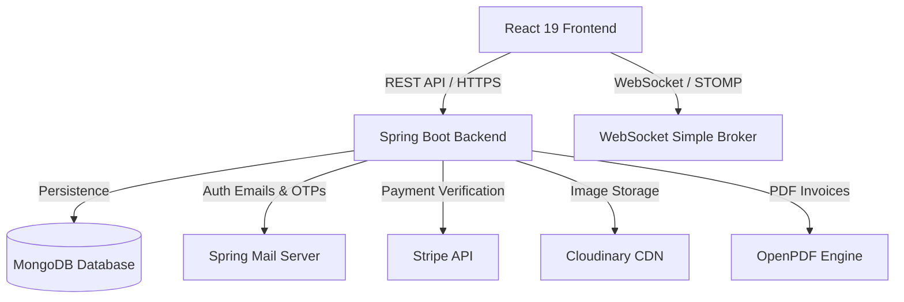

# 🍽️ RestroX - Restaurant Ordering & Management System

A premium, full-stack, multi-role restaurant management and food ordering system. The platform allows customers to browse menus, place orders, book tables, and process payments. It also features a real-time Kitchen Display System (KDS) for chefs, and a comprehensive management panel for restaurant admins and system administrators.

---

## 🏗️ Architecture Overview

The system follows a decoupled client-server architecture with real-time updates and third-party integrations:



---

## 🌟 Key Features

### 👤 Multi-Role Dashboard & Access Control
The application supports fine-grained access control with distinct dashboards and views for each user role:
*   **Main Admin:** Manages restaurant accounts, system configurations, and high-level platform administration.
*   **Restaurant Admin:** Full control over menu items (categories, prices, active status), table management, coupon creation, staff registration, and sales analytics.
*   **Chef (Kitchen Staff):** Real-time access to the **Kitchen Display System (KDS)** to view pending orders, prioritize preparation, and update order statuses (e.g., Cooking, Ready).
*   **Customer (User):** Register/login, browse foods, manage cart, apply coupons, make secure payments, track active orders, and reserve dining tables.

### 📱 Dine-In QR Code Ordering
*   Pre-configured table QR codes map to `/r/{restaurantId}/t/{tableNumber}`.
*   Scanning a QR code pre-selects the customer's restaurant and table number automatically for a seamless checkout experience.

### ⚡ Real-Time Synchronized Kitchen Notifications
*   Uses **STOMP WebSockets** over SockJS.
*   Instant notification delivery to the kitchen display when a new order is paid or placed.
*   Real-time status updates pushed directly to the customer’s order tracking screen.

### 💳 Secure Payments & Invoicing
*   **Stripe Payment Gateway** integration for credit/debit card processing.
*   Automated receipt and invoice generation as a downloadable PDF using **OpenPDF**.

### 🔐 Passwordless & Secure Authentication
*   JSON Web Token (JWT) stateless authorization.
*   OTP-based login and password resets using **Spring Boot Starter Mail**.

---

## 🛠️ Technology Stack

### Frontend
*   **Core Framework:** React 19 & Vite
*   **UI Components:** Material UI (MUI) v7, Emotion, and Lucide React Icons
*   **Routing:** React Router DOM v7
*   **Real-time Communication:** StompJS & SockJS-Client
*   **State & Data Fetching:** React Context API, React Hooks, and Axios
*   **Analytics & PDF:** Recharts, jsPDF, and jsPDF-AutoTable

### Backend
*   **Core Framework:** Spring Boot 3.5.8 & Spring Web
*   **Language:** Java 21
*   **Database:** MongoDB via Spring Data MongoDB
*   **Security:** Spring Security & JJWT (JSON Web Token)
*   **Notification Engine:** Spring WebSocket
*   **Email Client:** Spring Boot Starter Mail (SMTP)
*   **Payment SDK:** Stripe Java Client Library
*   **Image Management:** Cloudinary Java SDK
*   **PDF Generation:** LibrePDF / OpenPDF
*   **Boilerplate reduction:** Project Lombok

---

## 📂 Directory Structure

```text
restaurant-ordering-system/
├── Backend/                    # Spring Boot Project
│   ├── src/
│   │   ├── main/
│   │   │   ├── java/com/example/Full_Stack_Food_Delivery_App/
│   │   │   │   ├── controller/      # REST API Controllers
│   │   │   │   ├── entity/          # MongoDB Documents (User, Order, Food, Table, etc.)
│   │   │   │   ├── filter/          # Security & JWT Authentication Filters
│   │   │   │   ├── io/              # DTOs / Request & Response Payloads
│   │   │   │   ├── repository/      # MongoDB Spring Data Repositories
│   │   │   │   ├── service/         # Business Logic Implementations
│   │   │   │   └── util/            # JWT & OTP Utility Helpers
│   │   │   └── resources/
│   │   │       └── application.properties # Application Configuration Properties
│   │   └── test/                    # Integration & Unit Tests
│   ├── pom.xml                      # Maven Dependencies
│   └── Dockerfile                   # Deployment container blueprint
└── Frontend/                   # React Vite Project
    ├── src/
    │   ├── components/              # Shared UI Widgets (Login, ProtectedRoute, PlaceOrder, etc.)
    │   ├── context/                 # Auth and Cart Global Context Providers
    │   ├── pages/                   # Application Views (Admin, Cart, ExploreFood, Kitchen, etc.)
    │   ├── App.jsx                  # App Navigation Router Setup
    │   ├── index.css                # Base Design Tokens & CSS Style Setup
    │   └── main.jsx                 # Application Entry Point
    ├── package.json                 # Node Package configuration & dependencies
    └── vite.config.js               # Vite Compilation Setup
```

---

## 🚀 Setup & Installation

### Prerequisites
*   [Java 21 JDK](https://www.oracle.com/java/technologies/downloads/)
*   [Node.js](https://nodejs.org/) (v18 or higher)
*   [MongoDB](https://www.mongodb.com/try/download/community) running locally on port `27017`

### 1. Database Setup
1. Start your local MongoDB server:
   ```bash
   mongod --dbpath <your_db_path>
   ```
2. The backend will automatically create the database `food_delivery_db` and all required collections upon startup.

### 2. Backend Configuration
1. Open application.properties and configure your database URI:
   ```properties
   spring.data.mongodb.uri=mongodb://localhost:27017/food_delivery_db
   ```
2. Set the following environment variables (or replace placeholders in `application.properties` directly for local testing):
   *   `MAIL_USERNAME`: Your SMTP Gmail address.
   *   `MAIL_PASSWORD`: Your Gmail app password.
   *   `STRIPE_SECRET_KEY`: Your Stripe testing API secret key.

3. Start the backend:
   ```bash
   cd Backend
   ./mvnw spring-boot:run
   ```
   The backend server will run on `http://localhost:8081`.

### 3. Frontend Configuration
1. Navigate to the Frontend directory:
   ```bash
   cd Frontend
   ```
2. Verify or update variables in `.env` (API URL pointing to `http://localhost:8081`).
3. Install dependencies and run in development mode:
   ```bash
   npm install
   npm run dev
   ```
   The frontend will run on `http://localhost:5173`.

---

